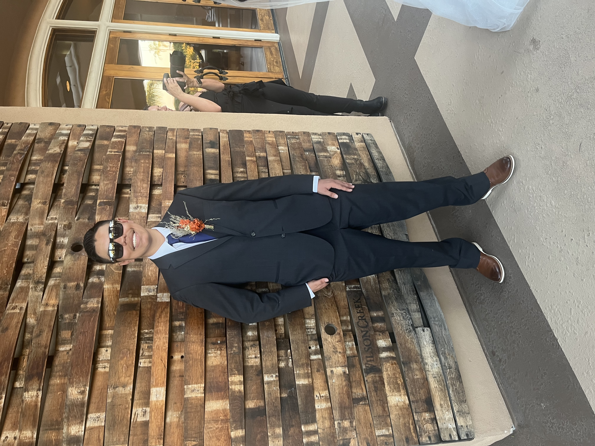
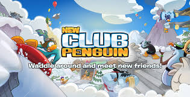
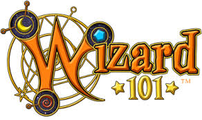
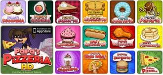
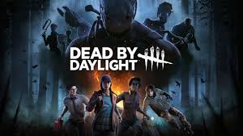

# Karim's CS 110 User Page 

**Howdy, my name is Karim Barajas and welcome to my page!** 



If you want to take a look on my very first take of this course, **please click** on this
[link](README.md) to view my README file.

Before continuting to my page, if you are having a bad day and need something **to cheer you up**. Please **click** [here](#funny-cs-quote) to read a funny CS quote.

If you **click** [here](https://www.toontownrewritten.com/), it will take you to a site of one of my favorite games that I used to play when I was young. Sadly, the original game was shutdown years ago by Disney. So, a group of fans created a fan made version of the game for those wanting to keep playing or to simply just return to their childhood.

## About Me:
- I am a 4th year CS student in Muir College
- I am from San Diego area
- I have an older sister
- I have a dog name Dory 
- One of my favorite books that I grew up reading in elementary school was *Diary of a Wimpy Kid*
- I play video games on my Nintendo Switch, PS5, Xbox, and sometimes my computer
- I am in the Triton Quantative Trading Club, which I am their designer and potentially being part of their Data Science or Software group
- I am also in the Video Game Development Club, which I am currently working on a game project with my group for two weeks

**Speaking of games, these are some of my favorites that I am currently playing or played before**






## My Bucket List to Travel:
1. France
2. Hawaii
3. Bora Bora
4. Rome
5. Greece
6. Brazil
7. Japan
8. South Korea

### My College Goals
- [x] Get accepted to UCSD
- [x] Survive my 1st year
- [x] Survive my 2nd year
- [x] Survive my 3rd year
- [ ] Survive my 4th year
- [x] Make friends
- [x] Join clubs
- [x] Participate in a hackathon
- [ ] Graduate with a BS for CS

### Funny CS Quote
> "If debugging is the process of removing software bugs, then programming must be the process of putting them in."
> Edsger Dijkstra, computer science pioneer

### Favorite Code Snippet

```html
<!DOCTYPE html>
<html>
  <head>
    <title>My Page</title>
  </head>
  <body>
    <h1>Hello, world!</h1>
  </body>
</html>